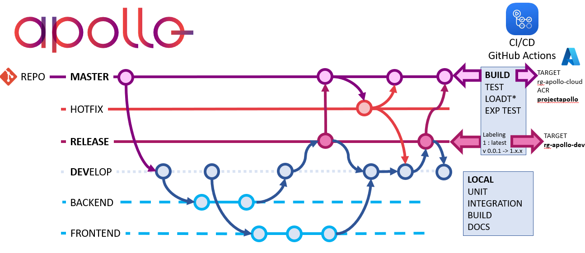

# PR Guide

This guide is intended to help you get started with contributing to the APOLLO project. It will help you understand the project, how to contribute, and how to build and test your changes to the code.

## Git Branches

The APOLLO project uses the following git branches:

- MASTER: This is the branch that is used for the latest release. Note we use different build pipelines for the cloud and and mobile app development. The cloud development is done in the backend branch and the mobile app development is done in the frontend branch. The dev branch is a combination of both the latest development of the cloud and mobile development.
The (dev)mobile branch is merged into the release branch when the mobile app is ready for testing. The (dev)backend branch is merged into the release branch when the cloud development is ready for testing. The release branch is merged into the master branch when backend and mobile are ready for release. 

- HOTFIX: This is the branch that is used for the latest hotfix release to the production environment rg-apollo-cloud. Note This is only used for the cloud development. And is not used for the mobile app development.

- RELEASE: This is the branch that is used for the latest release. Note we use different build pipelines for the cloud and and mobile app development. This branch is used for the build pipeline for the cloud as well as mobile app. Note: It contains a automatic deployment to rg-apollo-dev infrastructure as well as the app test environment.

- DEVELOP: This is the branch that is used for the latest development. It contains the latest code that has been merged into the repository. 

- BACKEND: This is the branch that is used for the latest development regarding the backend and cloud stuff.

- FRONTEND: This is the branch that is used for the latest development regarding the frontend development and mobile app stuff.

- FEATURE BRANCHES: This is the branch that is used for the latest regarding the features that are being developed. There are feature branches for the backend as well as the frontend. 

## Contributing

### Before you start

Before you start working on a contribution, please make sure there is an issue for it, and discuss your intended solution with the APOLLO team. If you have a new idea, please start a discussion on the [apollo discord channel](https://discord.gg/PqKZarB6)

Also check out our [contributing guide](CONTRIBUTING.md) for more details on contributing to APOLLO.

### Contributing process
